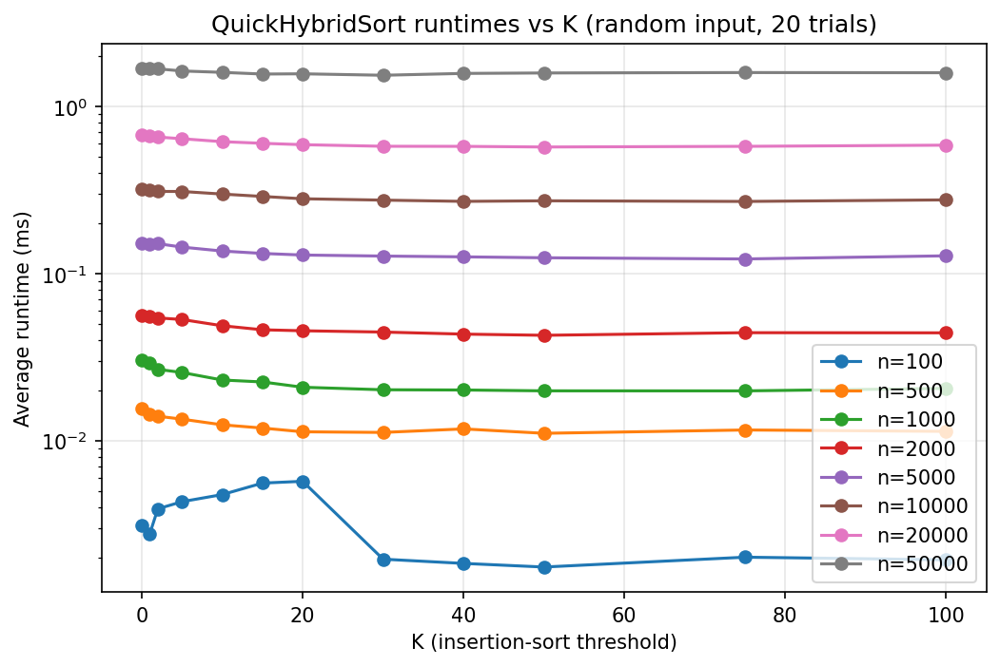
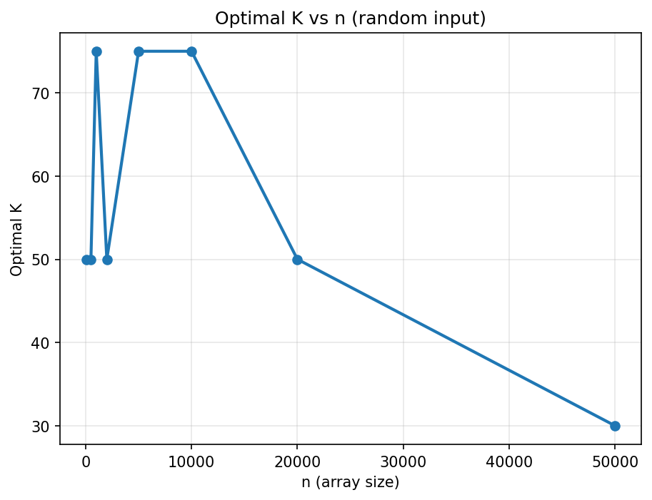
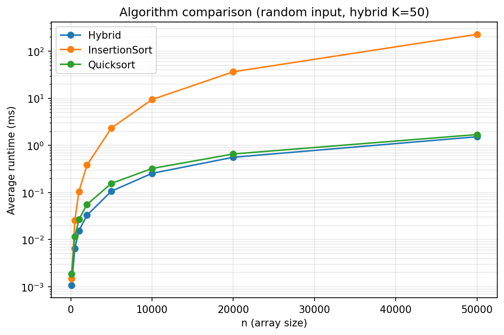
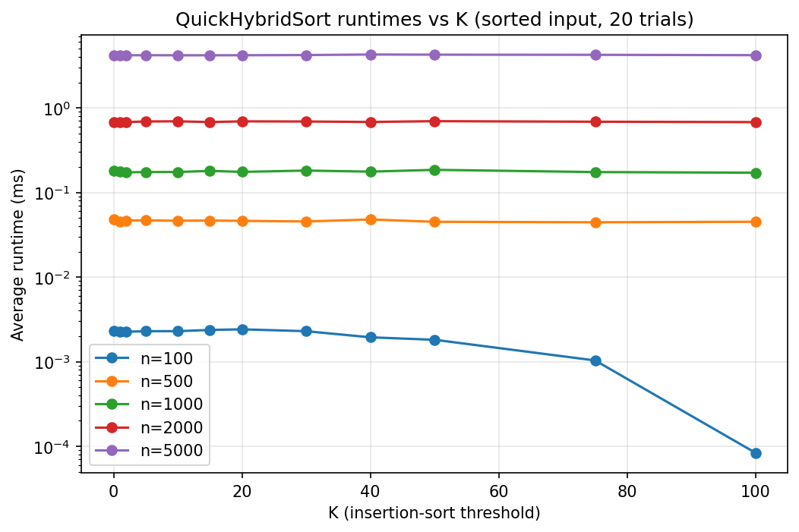
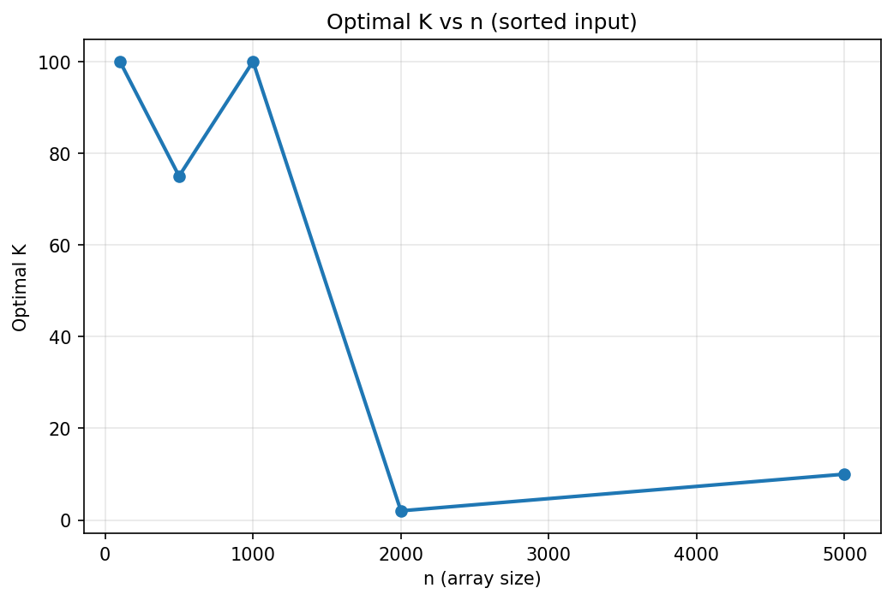
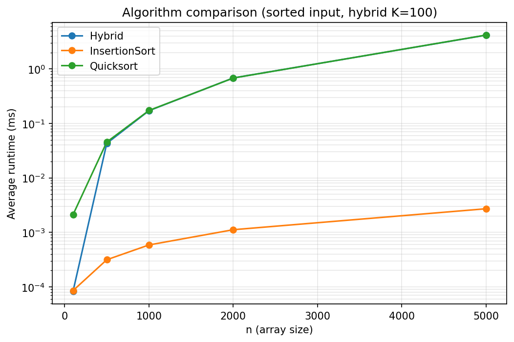
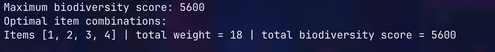

# CS 3364 Design and Analysis of Algorithms Project

Jackson Clark
May 5th, 2026

## Part 1: Quick-Based Hybrid Sorting

### Deliverable 1.1: Source Code and Correctness Verification

The sorting implementation is in `Sorting.java` and is tested from `Main.java`. QuickHybridSort(A, K) sorts an integer array in ascending order. It uses Quicksort on larger subarrays and switches to Insertion sort when the current subarray length is <= K.

Sorting methods:

- `Sorting.quickHybridSort(int[] arr, int K)`: main entry point for hybrid sort
- `Sorting.insertionSort(int[] arr, int low, int high)`: insertion sort used for smaller subarrays
- `Sorting.partition(int[] arr, int low, int high)`: quicksort partition that uses the last element as the pivot.

Correctness was verified by comparing the output of QuickHybridSort with Java's built in Arrays.sort. The tests covered various input sizes, different K values, and multiple edge cases.

Program correctness output:

### Deliverable 1.2: Average Runtime vs K

Random arrays were tested with 20 different trials for each combination of input size and threshold. The input sizes tested were 100, 500, 1000, 2000, 5000, 10000, 20000, and 50000. The threshold values tested were 0, 1, 2, 5, 10, 15, 20, 30, 40, 50, 75, and 100.

**Figure 1.** Average runtime of QuickHybridSort vs threshold K for random input.

When dealing with random input, using a very small K makes the algorithm behave like standard quicksort. Mid size K values improve performance by avoiding extra recursion calls on small subarrays. If K gets too large, performance will tank due to insertion sort quadratic behavior on larger subarrays.

### Deliverable 1.3: Optimal K and Algorithm Comparison

The optimal K for each random input size was chosen as the tested K with the lowest average runtime.

**Figure 2.** Measures optimal K versus input size n for random arrays.

The data shows the best thresholds for random inputs fall between 30 and 75. The optimal value fluctuates due to the overall runtime from a mix of overhead recursion, cost of running insertion sort on small arrays, random input variation, and general measurement noise.

**Figure 3.** Runtime comparison of insertion sort, quicksort, and QuickHybridSort on random input. 

For the comparison plot, K = 50 was used as a threshold because it performed consistently across the random input sizes, even though the optimal K varies by n. 

Insertion sort slows down due to its average case time complexity $\Theta(n^2)$, as n grows. Quicksort handles the random input much better due to its average time complexity $\Theta(n \log n)$. The hybrid version is the best due to it using both quicksort and insertion sort depending on the subarray size.

### Deliverable 1.4: Sorted Input Tests and Explanation

Tasks 2 and 3 were repeated with pre sorted arrays.

**Figure 4.** Average runtime of QuickHybridSort versus threshold K for pre sorted input.

The sorted inputs results look very different due to the partition method using the last element as the pivot. An already sorted array will result in the worst case scenario. The last element is always the largest, meaning every single partition is unbalanced. This drops quicksort performance from the usual $\Theta(n \log n)$ to $\Theta(n^2)$.

**Figure 5.** Measures optimal K versus input size n for sorted arrays.

**Figure 6.** Runtime comparison of insertion sort, quicksort, and QuickHybridSort on an already sorted input.

On sorted input, insertion sort is the winner. Quicksort lags behind because of the worst case pivot issue. While hybrid performs slightly better than quicksort, it still is not better than insertion sort on sorted data.

## Part 2: Intergalactic Zoo Trip: 0/1 Knapsack

### Deliverable 2.1: Subproblem Structure

This is a classic 0/1 Knapsack problem since we either take an item completely or leave it behind. We can define our dynamic programming state as: `dp[i][w] = maximum biodiversity score using the first i items with weight limit w` i ranges from 0 to 5, and w ranges from 0 to 18. The base cases are `dp[0][w] = 0` and `dp[i][0] = 0`. The final answer will be found at `dp[5][18]`.

### Deliverable 2.2: Recurrence Relation

For each item, the algorithm evaluates two choices: skip the item or take the item if it fits.

If item i is too heavy to fit: `dp[i][w] = dp[i - 1][w]`

If item i fits, we take the max score between skipping and packing it: `dp[i][w] = max(dp[i - 1][w], dp[i - 1][w - weight[i]] + score[i])`

### Deliverable 2.3: Dynamic Programming Implementation

The solution is implemented in `Knapsack.java`.

Program output:

### Deliverable 2.4: Optimal Combinations and Justifications

The maximum biodiversity score is 5600, which we get from packing items 1, 2, 3, and 4 together.

Total weight: 6 + 4 + 5 + 3 = 18

Total biodiversity score: 1600 + 1000 + 1800 + 1200 = 5600

This combination uses the full luggage capacity of 18 and gives the maximum possible biodiversity score. The use of DP backtracking found this as the only optimal combination. 